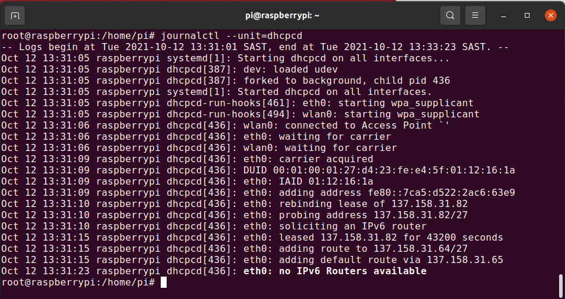
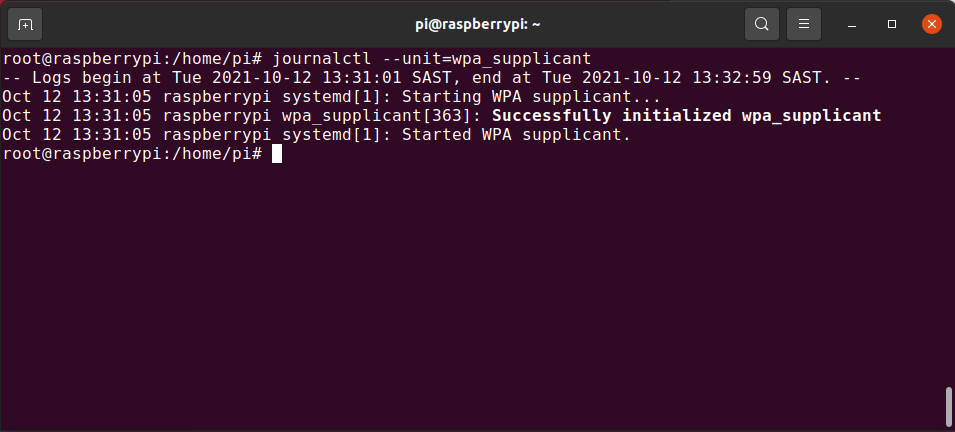

# Authenticated 802.1x Wired Connectivity for the Raspberry Pi

# Requirements: 
 
- Raspberry Pi Model 3 / Model 4 
- Operating System: Raspbian 10

# Introduction: 

This repository contains the documentation and configuration for connecting the Raspberry Pi mini computer to the University of Cape Town wired network using your university network credentials. More information regarding authentication can be found on the ICTS Website - here ( please add link here )

Each device connected to the wired network will be allocated a restricted IP address which allows access to a whitelisted set of locations on campus only. Upon successful configuration of the device, a routeable IP address will be assigned allowing for access to the internet and other services. 

# Initial Setup: 

1. Clone the respository from the following location ```git clone https://gitlab.uct.ac.za/cis/uct-connectivity/uct-8021x-wired```
2. Copy the [60-wpa_supplicant_802dot1x](https://gitlab.uct.ac.za/cis/uct-connectivity/uct-8021x-wired/-/blob/master/60-wpa_supplicant_802dot1x
) located in your cloned folder to ```/lib/dhcpcd/dhcpcd-hooks/``` on the Raspberry Pi - ``` sudo cp uct-8021x-wired/60-wpa_supplicant_802dot1x /lib/dhcpcd/dhcpcd-hooks/```
3. If you are setting up your Raspberry Pi for the first time, you can successfully copy the ```wpa_supplicant.conf``` file to the ```/etc/wpa_supplicant``` directory. However, I would strongly suggest viewing the file first especially since you may have credentials used to connect to the Eduroam WIFI network. If Eduroam is already configured for your Raspberry Pi, do not copy the file across as your credentials would match those already needed for a successful wired connection. 
4. Edit the ```/etc/wpa_supplicant/wpa_supplicant.conf``` file by using a suitable file editor to update the authentication credentials. 
```
# Wired network details 
network={
	ssid="tmpSSID"
	key_mgmt=IEEE8021X
	eap=PEAP MSCHAPV2
	identity="uct_credential_id@wf.uct.ac.za"
	password="uct_credential_password"
}
```
5. Next, edit the ```/etc/dhcpcd.conf ``` file and append the following at the end of the file:
``` 
# Use env to invoke a 802.1x wired wpa_supplicant dhcpcd-hook in /lib/dhcpcd/dhcpcd-hooks/60-wpa_supplicant_802dot1x.
interface eth0
env 802dot1x=1
```
6. Reboot the Raspberry Pi issuing ``` sudo reboot```  or restart networking with ```systemctl restart networking```

# Logging Information:

Logging information relavent for the services we just configured can be found by executing ```journalctl --unit=dhcpcd``` to ensure that a successful authenticated IP address is retrieved. 



Logging information related to the wpa-supplicant can be found by executing ```journalctl --unit=wpa_supplicant```


# Author Information: 
This repository is maintained by ICTS and the contributors listed in the repository. 


